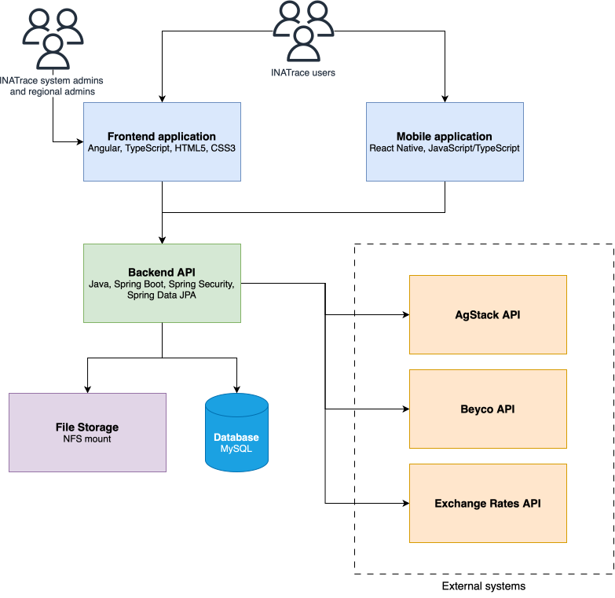
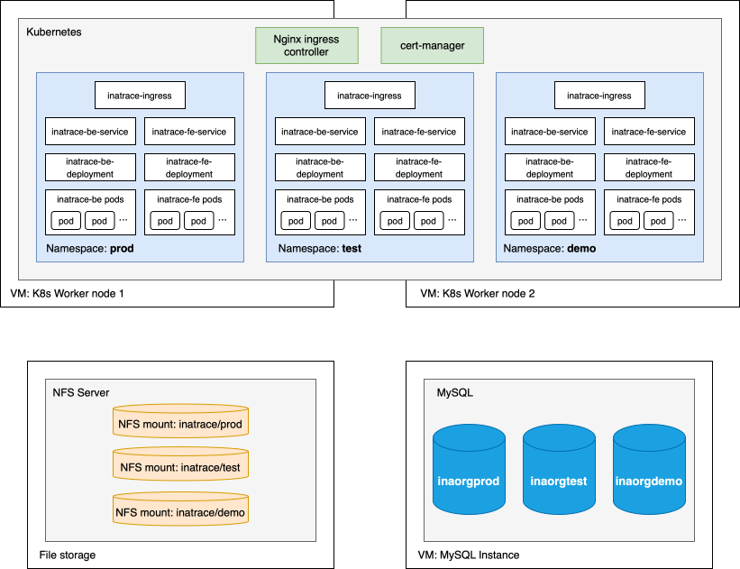

# INATrace technical documentation

## Introduction

INATrace is a comprehensive supply chain traceability platform designed to provide transparency and accountability
across agricultural value chains. This technical documentation provides detailed information about the system's
architecture, deployment options, configuration, and external integrations to assist developers, system administrators,
and technical stakeholders in understanding, deploying, and maintaining the platform.

## 1. High-Level Architecture Overview

### 1.1 System Components

The INATrace platform follows a modern microservices-based architecture consisting of the following core components:

- **Frontend Application**: Angular-based single-page application providing the user interface
- **Mobile Application**: React Native cross-platform mobile application for iOS and Android
- **Backend API**: Spring Boot REST API handling business logic and data management
- **Database Layer**: MySQL relational database for persistent data storage
- **File Storage**: Support for local and cloud-based file storage solutions
- **Authentication Service**: JWT-based authentication and authorization mechanism

### 1.2 Technology Stack

- **Frontend**: Angular, TypeScript, HTML5, CSS3
- **Mobile**: React Native, JavaScript/TypeScript
- **Backend**: Java, Spring Boot, Spring Security, Spring Data JPA
- **Database**: MySQL
- **Build Tools**: Maven (backend), npm/Angular CLI (frontend), npm/React Native CLI (mobile)
- **Container Support**: Docker, Docker Compose

The diagram below illustrates the high-level architecture of the INATrace platform, showing the interaction between the
main system components. The frontend and mobile applications communicate with the backend API through RESTful services,
while the backend manages data persistence through the MySQL database layer and handles file storage operations. The
authentication service ensures secure access control across all components using JWT tokens.

## 2. Deployment Topology

### 2.1 Kubernetes Deployment

The INATrace platform is deployed on Kubernetes (K8s) infrastructure, providing scalability, high availability, and
efficient resource management. The deployment architecture consists of three separate environments:

- **Test Environment**: Used for testing new features, bug fixes, and integration testing before promoting to production
- **Production Environment**: The live environment serving end users with production-grade data and configurations
- **Demo Environment**: A demonstration instance used for showcasing platform capabilities to potential clients and
  stakeholders

### 2.2 Ingress Configuration

Access to both frontend and backend services across all environments is managed through Nginx Ingress Controller. The
Nginx ingress handles:

- **Traffic Routing**: Directing incoming requests to appropriate frontend or backend services
- **SSL/TLS Termination**: Managing HTTPS certificates and secure connections
- **Load Balancing**: Distributing traffic across multiple service replicas
- **Path-Based Routing**: Routing requests based on URL paths to frontend or API endpoints

The diagram below shows the INATrace deployment topology on Kubernetes infrastructure. The platform utilizes a single
MySQL instance that hosts separate databases for each environment (Test, Production, and Demo), ensuring logical data
isolation while optimizing resource usage. File storage is implemented using NFS (Network File System) mounts, providing
shared and persistent storage across all environment pods. All environments are accessed through a unified Nginx Ingress
Controller that manages SSL/TLS termination, load balancing, and routing to the appropriate services.

## 3. Configuration Parameters

The INATrace platform requires proper configuration of both backend and frontend components to function correctly.
Configuration parameters control various aspects of the system, including database connections, external service
integrations, security settings, and application behavior. This section outlines the key configuration parameters for
each component.

### 3.1 Backend Configuration

### 3.2 Frontend Configuration
